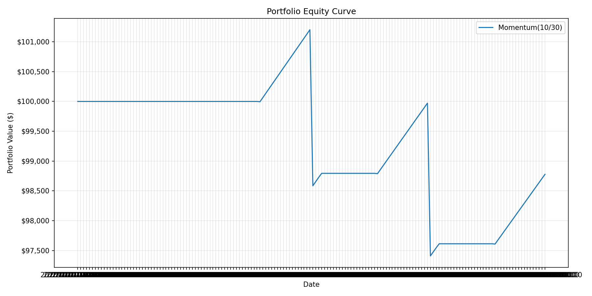
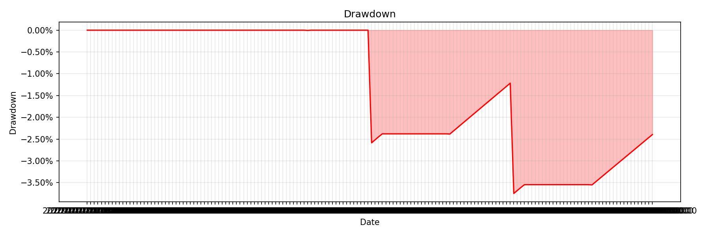
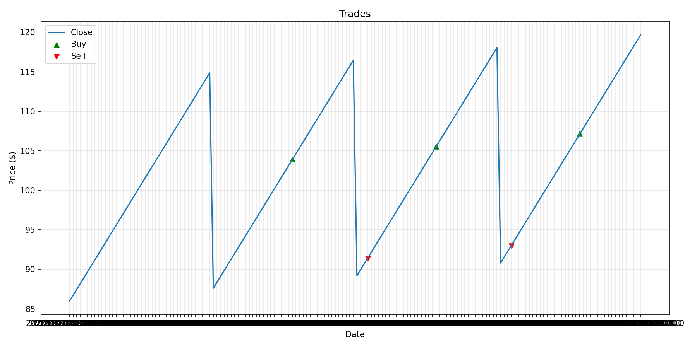
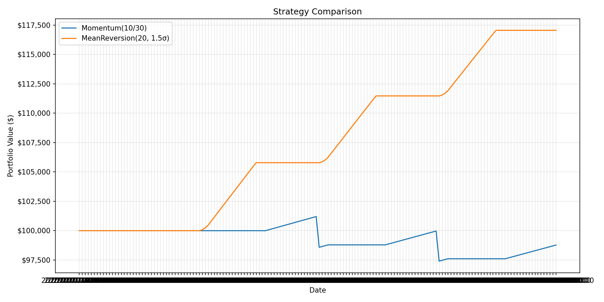

# Backtester

Backtester is an event-driven Python backtesting engine for running pluggable trading strategies over OHLCV data.

## Built From Scratch

No backtesting libraries are used. The data loading, strategy interface, portfolio simulation, performance metrics, visualization, and engine loop are implemented from first principles with general-purpose Python tools.

## Features

- Event-driven bar-by-bar simulation
- Pluggable `Strategy` abstract base class
- Multi-asset backtesting via aligned shared trading dates
- Historical OHLCV loading with yfinance and Parquet caching
- Portfolio simulation with per-share commission and basis-point slippage
- Fixed quantity, fixed dollar, all-in, percent-equity, and simplified volatility-target sizing
- Performance metrics from scratch
- Buy-and-hold benchmark comparison with alpha, beta, excess returns, and information ratio
- Trade-level round-trip analytics
- Static matplotlib visualization charts
- Grid search for strategy parameter sweeps
- CLI for backtests and grid searches
- Benchmark and cProfile scripts
- pytest, mypy, and GitHub Actions CI

## Architecture

```text
backtester/
├── backtester/
│   ├── data/
│   ├── strategy/
│   ├── portfolio/
│   ├── engine/
│   ├── metrics/
│   └── viz/
├── benchmarks/
├── docs/
├── examples/
└── tests/
```

The data, strategy, portfolio, metrics, and visualization modules stay independent. The engine is the composition layer that wires a `DataLoader`, `Strategy`, `Portfolio`, and `BacktestConfig` together.

## Quick Start

```python
from backtester.data.loader import DataLoader
from backtester.engine import BacktestConfig, BacktestEngine
from backtester.metrics import generate_report, print_report
from backtester.strategy import MomentumStrategy

config = BacktestConfig(ticker="AAPL", start_date="2018-01-01", end_date="2023-12-31")
engine = BacktestEngine(
    loader=DataLoader(),
    strategy=MomentumStrategy(fast_window=10, slow_window=50),
    config=config,
)

result = engine.run()
print_report(generate_report(result))
```

## Multi-Asset Backtesting

Multi-asset runs use `MultiAssetBacktestConfig`, `MultiAssetBacktestEngine`, and a `MultiAssetStrategy`. The engine loads each ticker independently and aligns data on the intersection of available dates. This keeps one shared `current_index` and avoids forward-filling whole missing market sessions.

```python
from backtester.data.loader import DataLoader
from backtester.engine import MultiAssetBacktestConfig, MultiAssetBacktestEngine
from backtester.strategy import MomentumStrategy, SingleStrategyMultiAssetWrapper

config = MultiAssetBacktestConfig(tickers=["AAPL", "MSFT", "GOOG"], start_date="2020-01-01", end_date="2023-12-31")
strategy = SingleStrategyMultiAssetWrapper(lambda: MomentumStrategy(10, 50))
result = MultiAssetBacktestEngine(DataLoader(), strategy, config).run()
```

Signals are processed in config ticker order. In multi-asset `ALL_IN` mode, each BUY uses currently available cash when that ticker is processed.

## Grid Search

Parameter sweeps live in `backtester.research`:

```python
from backtester.research import run_grid_search
from backtester.strategy import MomentumStrategy

results = run_grid_search(
    loader=DataLoader(),
    strategy_factory=MomentumStrategy,
    param_grid={"fast_window": [5, 10], "slow_window": [30, 50]},
    config=config,
)
print(results)
```

Invalid combinations are recorded in an `error` column so one bad parameter set does not stop the whole sweep.

## Strategies

`MomentumStrategy` uses fast and slow simple moving averages on close prices. It buys when the fast SMA crosses above the slow SMA and sells when it crosses below.

`MeanReversionStrategy` uses Bollinger-style bands around a rolling mean. It buys when price is at or below the lower band and sells when price is at or above the upper band.

Both strategies implement the same `Strategy` interface and are interchangeable in the engine.

## Performance Metrics

Implemented metrics:

- Total return
- Annualized return
- Sharpe ratio
- Sortino ratio
- Max drawdown
- Win rate
- Profit factor
- Alpha and beta
- Information ratio
- Excess returns
- Trade summary analytics

## Benchmarking

`buy_and_hold_equity` creates a simple benchmark curve by buying as many shares as possible at the first close and holding. `generate_report(..., benchmark_equity=benchmark)` adds benchmark total return, excess total return, alpha, beta, and information ratio.

## Visualization

Chart helpers live in `backtester.viz`:

- `plot_equity_curve`
- `plot_drawdown`
- `plot_trades`
- `plot_strategy_comparison`

Generate example PNGs with:

```bash
python examples/generate_charts.py
```

If generated, example charts are written to `docs/equity_curve.png`, `docs/drawdown.png`, `docs/trades.png`, and `docs/comparison.png`.






## Performance Optimization

The Stage 4 engine prevented look-ahead bias structurally by slicing `data.iloc[:i + 1]` before each strategy call. Stage 7 removes that expensive per-bar DataFrame copy.

The optimized interface passes the full DataFrame plus `current_index`:

```python
strategy.generate_signal(data, current_index=i)
```

This improves speed by allowing:

- Precomputed rolling indicators
- Full-DataFrame strategy access without repeated slicing
- NumPy close-price access in the engine hot loop

The tradeoff is important: look-ahead prevention is now a strategy contract. Strategies must never read rows after `current_index`. Built-in strategies are tested against slow sliced-reference implementations to guard this behavior.

Benchmark instructions and current result table live in [docs/benchmark_results.md](docs/benchmark_results.md). No fake benchmark numbers are included.

## Testing

```bash
pytest
pytest --cov=backtester
mypy backtester
```

## Examples

```bash
python examples/run_demo.py
python examples/simple_momentum.py
python examples/compare_strategies.py
python examples/generate_charts.py
python examples/grid_search_demo.py
python examples/multi_asset_demo.py
```

## CLI

```bash
python -m backtester.cli run --ticker AAPL --strategy momentum --start 2020-01-01 --end 2023-12-31 --benchmark
python -m backtester.cli grid-search --ticker AAPL --start 2020-01-01 --end 2023-12-31 --fast-windows 5,10 --slow-windows 30,50
```

The CLI uses live/cached `DataLoader` data. The example scripts use synthetic data where possible so they are safer for offline demos.

## Tech Stack

- Python 3.11+
- pandas
- numpy
- yfinance
- pyarrow
- matplotlib
- pytest
- mypy
