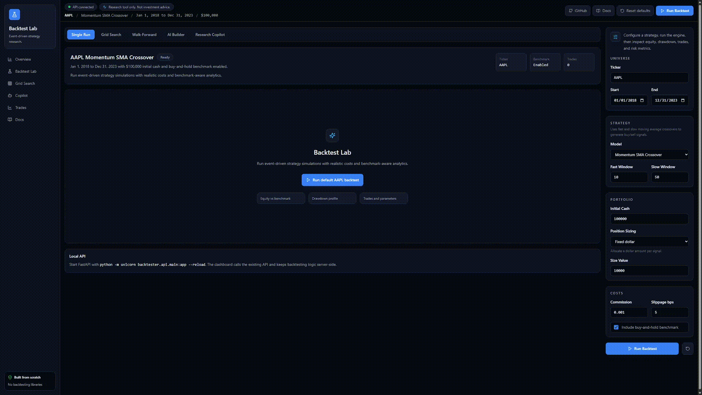
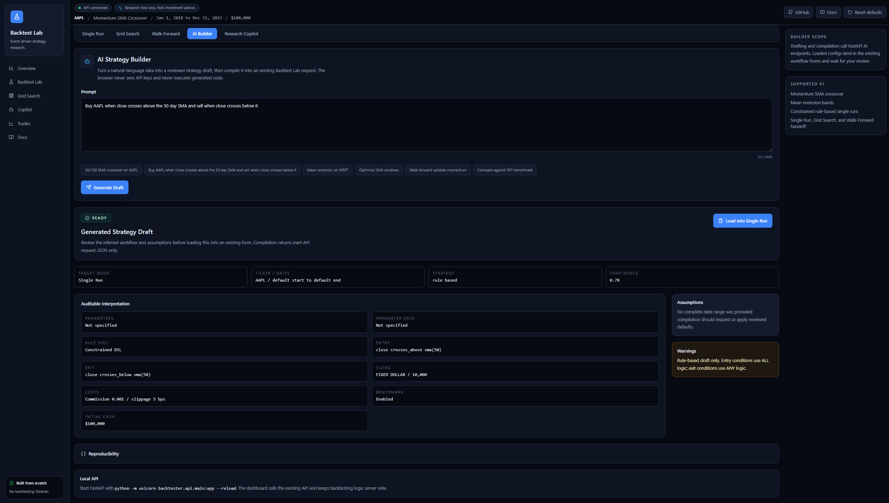
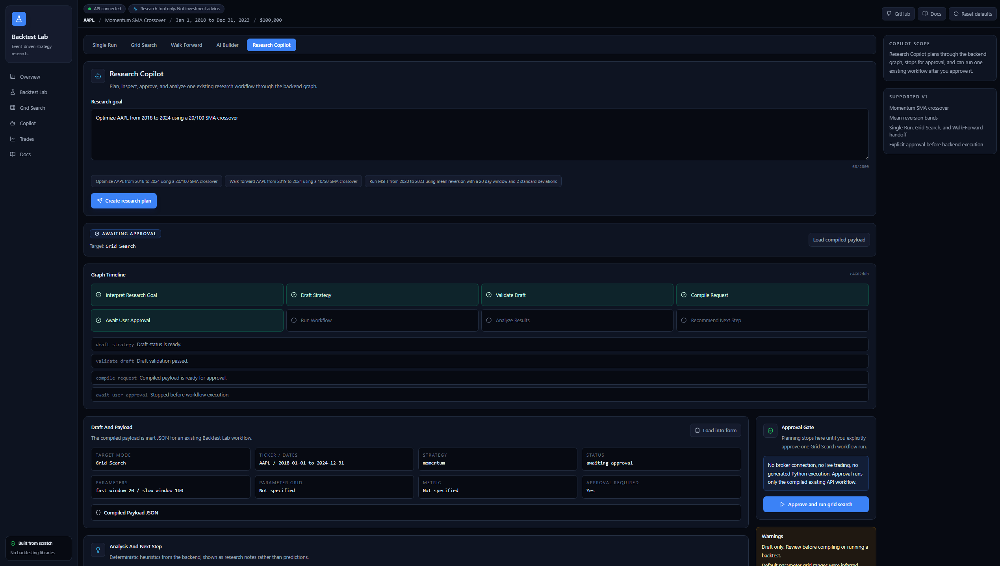
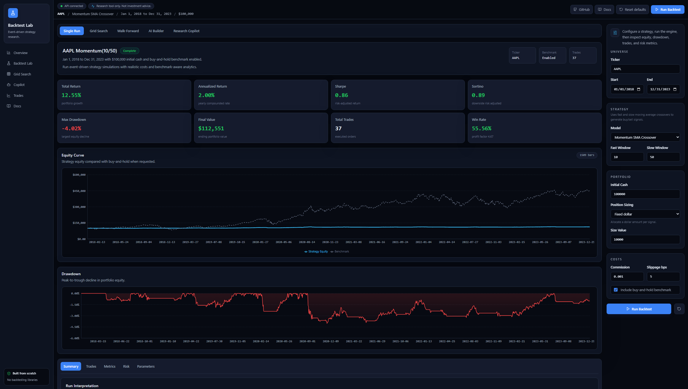
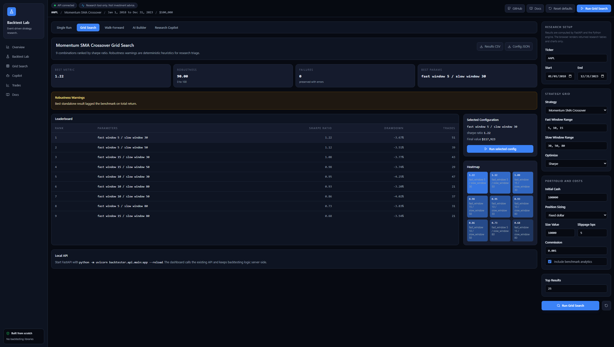
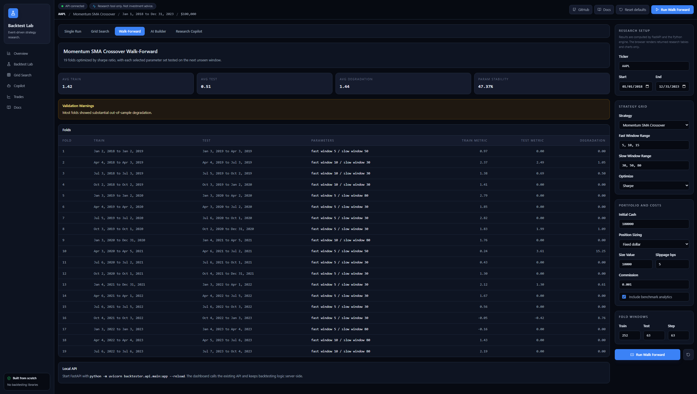
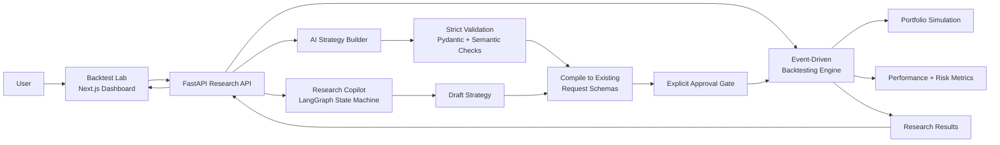

<div align="center">

# Backtest Lab AI

**An AI-assisted strategy research platform for designing, testing, and analyzing trading strategies over historical market data.**

A from-scratch event-driven backtesting engine, a FastAPI research API, a Next.js dashboard, a natural-language strategy builder, and a LangGraph-powered Research Copilot — assembled into one local research workstation.

[](https://github.com/codysj/AI-Backtest-Lab/actions/workflows/ci.yml)


[](LICENSE)



</div>

> [!NOTE]
> **Research tool only.** Not investment advice. No brokerage integration, live trading, or order placement.

---

## Table of Contents

- [Overview](#overview)
- [Core Capabilities](#core-capabilities)
- [System Architecture](#system-architecture)
- [AI Safety Design](#ai-safety-design)
- [Example Research Flow](#example-research-flow)
- [Built From Scratch](#built-from-scratch)
- [Tech Stack](#tech-stack)
- [Quick Start](#quick-start)
- [API Overview](#api-overview)
- [Strategy Support](#strategy-support)
- [AI Provider Configuration](#ai-provider-configuration)
- [Python & CLI Usage](#python--cli-usage)
- [Testing & CI](#testing--ci)
- [Current Limitations](#current-limitations)
- [Roadmap](#roadmap)
- [Why This Project](#why-this-project)

---

## Overview

Many beginner backtesting projects stop at a script that runs a moving-average strategy and prints a Sharpe ratio. Backtest Lab AI is built as a complete local research environment instead:

- A reusable **event-driven backtesting engine** with full portfolio accounting.
- **Performance and risk analytics** implemented from first principles — no `quantstats`, no `empyrical`.
- **Grid search and walk-forward validation** for serious strategy research.
- A **browser-based research workstation** backed by FastAPI.
- A **natural-language strategy builder** with a constrained AI validation and compile pipeline.
- An **agentic Research Copilot** with explicit approval gates before any execution.

> The goal is not to build a trading product. The goal is to demonstrate the architecture behind one.

The repository is named `backtester` internally; the broader product surface is branded **Backtest Lab AI**.

---

## Core Capabilities

### AI-Assisted Research

Turn a plain-English prompt into a structured, validated strategy draft — then compile it directly into an existing backtest, grid-search, or walk-forward request.



- Natural-language strategy builder that turns prompts into structured, validated drafts.
- Compile-only handoff into existing backtest, grid-search, or walk-forward request schemas.
- Backend-only provider configuration: deterministic fake, OpenRouter, OpenAI-compatible, DeepSeek, and optional LangChain OpenAI-compatible providers.
- Strict Pydantic validation, semantic checks, sanitized errors, and extra-field rejection before workflow handoff.
- A constrained rule-based strategy DSL instead of generated executable code.

The **Research Copilot** plans a full research workflow, then stops at an explicit approval gate before anything runs.



- Research Copilot workflow powered by backend graph state transitions.
- Explicit approval gate before a Copilot-generated workflow can run.
- Deterministic post-run analysis and next-step recommendations.

### Backtesting Engine

A bar-by-bar event-driven simulation with realistic portfolio accounting — KPI cards, equity curve, drawdown, and trade-level analytics.



- Event-driven bar-by-bar simulation.
- Pluggable strategy interfaces for single-asset and Python-side multi-asset workflows.
- Built-in momentum SMA-crossover and mean-reversion strategies.
- Rule-based strategy execution from a validated, non-executable DSL.
- Portfolio simulation with cash, positions, orders, trades, commissions, slippage, and equity curves.
- Position sizing modes: fixed quantity, fixed dollar, all-in, percent equity, and simplified volatility targeting.
- Buy-and-hold benchmark comparison and trade-level analytics.

### Research Workflows

Sweep a parameter grid to map a strategy's performance surface, with failed combinations captured and robustness warnings surfaced.



- Single-run backtests.
- Parameter grid search with failed-combination capture.
- Heatmap-ready grid-search response data.
- Deterministic robustness warnings.

Validate stability out-of-sample with rolling train/test folds.



- Walk-forward validation with train/test folds.
- Parameter stability and degradation summaries.

### Analytics

Metrics are implemented directly rather than delegated to financial analytics libraries:

| Returns | Risk-Adjusted | Drawdown & Tail | Trade Quality |
| --- | --- | --- | --- |
| Total return | Sharpe ratio | Max drawdown | Win rate |
| Annualized return | Sortino ratio | Drawdown duration | Profit factor |
| Excess return | Information ratio | VaR / CVaR | Best / worst day |
| Alpha / beta | Rolling Sharpe | Rolling drawdown | Monthly returns |

Rolling volatility, rolling Sharpe, and rolling drawdown are computed alongside the point-in-time metrics.

### Full-Stack Dashboard

Backtest Lab is a local browser-based research workstation built with Next.js, TypeScript, Tailwind CSS, Recharts, and lucide-react.

- Full-screen dark-mode dashboard with sidebar workflow navigation.
- API health indicator and strategy metadata loaded from FastAPI.
- Single Run, Grid Search, Walk-Forward, AI Builder, and Research Copilot modes.
- KPI cards, equity and drawdown charts, result tabs, trades table, risk analytics, and export tools.
- Natural-language AI Builder UI with auditable draft previews and compile-to-form handoff.
- Research Copilot timeline, compiled-payload preview, approval workflow, and server-generated analysis.

The frontend is intentionally an **API client**. It renders forms, charts, validation states, and workflow results, but it does not reimplement portfolio accounting, metric calculations, grid search, walk-forward logic, or backtesting behavior in TypeScript.

---

## System Architecture



For deeper implementation notes, see [docs/architecture.md](docs/architecture.md) and [docs/current-state.md](docs/current-state.md).

### Repository Structure

```text
Backtester/
├── backtester/
│   ├── ai/           # AI draft schemas, providers, validation, compiler
│   ├── agents/       # Research Copilot graph state, nodes, tools
│   ├── api/          # FastAPI routes, schemas, services
│   ├── data/         # yfinance loading, cleanup, Parquet cache
│   ├── engine/       # Single-asset and multi-asset engines
│   ├── metrics/      # Performance and risk metrics
│   ├── portfolio/    # Orders, trades, positions, portfolio accounting
│   ├── research/     # Grid search and walk-forward validation
│   ├── strategy/     # Strategy interfaces, built-ins, rule DSL
│   └── viz/          # Matplotlib chart helpers
├── frontend/
│   ├── app/          # Next.js App Router entrypoint
│   ├── components/   # Dashboard, charts, forms, AI and Copilot UI
│   └── lib/          # API client, types, defaults, validation
├── docs/
├── examples/
├── benchmarks/
├── tests/
├── pyproject.toml
└── requirements.txt
```

---

## AI Safety Design

The AI layer treats model output as **useful but untrusted**. It does not execute generated Python or arbitrary tool calls. Instead, the system uses:

- JSON-only provider outputs.
- Strict Pydantic schemas with extra fields rejected.
- Semantic validation for supported tickers, dates, parameters, strategy kinds, and unsupported concepts.
- A constrained rule-based strategy DSL.
- Compile-only handoff into existing API request schemas.
- Backend-only API keys.
- Explicit user approval before Research Copilot can run a workflow.
- Revalidation of browser-returned approval payloads before execution.
- Sanitized validation errors that avoid leaking secrets or raw malformed payloads.

---

## Example Research Flow

A user enters:

```text
Find a robust AAPL momentum strategy from 2018 to 2023 and compare against buy-and-hold.
```

Research Copilot then:

1. Interprets the research goal.
2. Drafts a structured strategy request.
3. Validates the draft.
4. Compiles it into an existing backtest, grid-search, or walk-forward payload.
5. **Stops before execution.**
6. Shows warnings, assumptions, unsupported items, and the compiled request.
7. Requires explicit approval.
8. Runs exactly one approved workflow.
9. Returns deterministic analysis and a recommended next step.

The AI layer does not bypass the engine, invent execution logic, generate executable strategy code, or place trades.

---

## Built From Scratch

The core engine intentionally avoids domain-specific backtesting and financial metrics libraries.

| ❌ Deliberately not used | ✅ Implemented directly |
| --- | --- |
| `backtrader` | Data loading and schema validation |
| `zipline` | Strategy interfaces and event-driven simulation loops |
| `quantstats` | Portfolio accounting, commission, and slippage modeling |
| `empyrical` | Equity curve generation and benchmark comparison |
| | Performance and risk metrics |
| | Grid search and walk-forward validation |
| | Visualization helpers |

General-purpose tools such as Pandas, NumPy, FastAPI, Pydantic, Matplotlib, Recharts, and Next.js are used where appropriate.

---

## Tech Stack

| Layer | Technologies |
| --- | --- |
| **Backend** | Python 3.11+ · Pandas · NumPy · yfinance · pyarrow |
| **API** | FastAPI · Pydantic · Uvicorn · httpx · python-dotenv |
| **AI / Agents** | LangGraph · optional LangChain OpenAI-compatible provider |
| **Frontend** | Next.js 15 (App Router) · React 18 · TypeScript · Tailwind CSS · Recharts · lucide-react |
| **Quality** | pytest · pytest-cov · mypy (strict) · GitHub Actions CI · frontend lint / typecheck / audit / build |

Additional tooling: backend-only AI secrets loaded from a private `.env`, and a Parquet cache for historical OHLCV data.

---

## Quick Start

### 1. Create a Python environment

**Windows PowerShell**

```powershell
py -m venv .venv
.\.venv\Scripts\Activate
python -m pip install -r requirements.txt
```

**macOS / Linux**

```bash
python3 -m venv .venv
source .venv/bin/activate
python -m pip install -r requirements.txt
```

### 2. Run backend validation

```bash
python -m pytest
python -m mypy backtester
python -m pytest --cov=backtester
```

### 3. Start the FastAPI backend

```bash
python -m uvicorn backtester.api.main:app --reload
```

The API runs at `http://localhost:8000` by default.

### 4. Start the frontend

In a second terminal:

```bash
cd frontend
npm install
npm run dev
```

Open `http://localhost:3000`.

> Backtest Lab uses Next.js 15 and requires a compatible Node.js runtime: `^18.18.0`, `^19.8.0`, or `>=20.0.0`.

---

## API Overview

FastAPI app: [`backtester/api/main.py`](backtester/api/main.py)

| Method | Endpoint | Description |
| --- | --- | --- |
| `GET` | `/health` | API health check |
| `GET` | `/api/strategies` | Strategy metadata for frontend forms |
| `POST` | `/api/backtest` | Run a single-asset backtest |
| `POST` | `/api/grid-search` | Run a parameter sweep |
| `POST` | `/api/walk-forward` | Run rolling train/test validation |
| `POST` | `/api/ai/strategy-draft` | Convert natural language into a validated strategy draft |
| `POST` | `/api/ai/compile` | Compile a draft into an existing workflow request |
| `POST` | `/api/ai/research-plan` | Run Research Copilot through planning and compile steps |
| `POST` | `/api/ai/research-approve` | Approve and run one compiled workflow |

By default, the frontend calls `http://localhost:8000`. Override with `frontend/.env.local`:

```bash
NEXT_PUBLIC_API_URL=http://localhost:8000
```

API CORS defaults to `http://localhost:3000` and `http://127.0.0.1:3000`. Additional origins can be configured with `BACKTESTER_CORS_ORIGINS`.

---

## Strategy Support

<details>
<summary><strong>Momentum SMA Crossover</strong></summary>

Uses fast and slow simple moving averages on close prices.

- Buy when the fast SMA crosses above the slow SMA.
- Sell when the fast SMA crosses below the slow SMA.

</details>

<details>
<summary><strong>Mean Reversion</strong></summary>

Uses Bollinger-style bands around a rolling mean.

- Buy when price is at or below the lower band.
- Sell when price is at or above the upper band.

</details>

<details>
<summary><strong>Rule-Based Strategy (constrained DSL)</strong></summary>

Uses a constrained, validated rule specification instead of generated code.

**Supported indicators:** `close`, `sma`, `rolling_high`, `rolling_low`, `bollinger_upper`, `bollinger_lower`

**Supported operators:** `>`, `<`, `>=`, `<=`, `crosses_above`, `crosses_below`

Entry conditions use `ALL` logic. Exit conditions use `ANY` logic. Rule-based drafts currently compile to single-run backtest requests, not grid-search optimization.

</details>

---

## AI Provider Configuration

AI Builder is **safe by default**. Without real provider environment variables, it uses a deterministic fake provider for local demos and tests.

To configure OpenRouter or another backend AI provider, create a private repo-root `.env` from the committed template:

```powershell
Copy-Item .env.example .env
```

Example backend `.env`:

```bash
BACKTESTER_AI_ENABLED=true
BACKTESTER_AI_PROVIDER=openrouter
BACKTESTER_AI_MODEL=tencent/hy3-preview:free
BACKTESTER_AI_API_KEY=your_openrouter_api_key_here
BACKTESTER_AI_BASE_URL=https://openrouter.ai/api/v1
BACKTESTER_AI_TIMEOUT_SECONDS=30
BACKTESTER_AI_USE_RESPONSE_FORMAT=true
BACKTESTER_AI_APP_NAME=Backtest Lab
BACKTESTER_AI_APP_URL=http://localhost:3000
```

Supported provider values: `fake`, `deepseek`, `openrouter`, `openai_compatible`, `langchain_openai_compatible`.

The optional LangChain provider requires `langchain-openai`, available through `python -m pip install ".[ai-langchain]"` or `python -m pip install -r requirements-ai-langchain.txt`.

> [!IMPORTANT]
> API keys must remain backend-only. Do not put backend AI keys in `frontend/.env.local`, and do not prefix backend secrets with `NEXT_PUBLIC_`.

---

## Python & CLI Usage

**Single-asset backtest**

```python
from backtester.data.loader import DataLoader
from backtester.engine import BacktestConfig, BacktestEngine
from backtester.metrics import generate_report, print_report
from backtester.strategy import MomentumStrategy

config = BacktestConfig(
    ticker="AAPL",
    start_date="2018-01-01",
    end_date="2023-12-31",
)

engine = BacktestEngine(
    loader=DataLoader(),
    strategy=MomentumStrategy(fast_window=10, slow_window=50),
    config=config,
)

result = engine.run()
print_report(generate_report(result))
```

**Multi-asset backtest (Python engine only)**

```python
from backtester.data.loader import DataLoader
from backtester.engine import MultiAssetBacktestConfig, MultiAssetBacktestEngine
from backtester.strategy import MomentumStrategy, SingleStrategyMultiAssetWrapper

config = MultiAssetBacktestConfig(
    tickers=["AAPL", "MSFT", "GOOG"],
    start_date="2020-01-01",
    end_date="2023-12-31",
)

strategy = SingleStrategyMultiAssetWrapper(
    lambda: MomentumStrategy(fast_window=10, slow_window=50)
)

result = MultiAssetBacktestEngine(
    loader=DataLoader(),
    strategy=strategy,
    config=config,
).run()
```

> Multi-asset support lives in the Python engine. It is not currently exposed through FastAPI, the CLI, or Backtest Lab.

**CLI**

```bash
python -m backtester.cli --help
python -m backtester.cli run --ticker AAPL --strategy momentum --start 2020-01-01 --end 2023-12-31 --benchmark
python -m backtester.cli grid-search --ticker AAPL --start 2020-01-01 --end 2023-12-31 --fast-windows 5,10 --slow-windows 30,50
```

The CLI uses live or cached data from `DataLoader`.

---

## Testing & CI

GitHub Actions runs Python and frontend quality gates on every push and pull request:

| Stage | Commands |
| --- | --- |
| **Python** | `python -m pytest` · `python -m mypy backtester` |
| **Frontend** | `npm ci` · `npm audit` · `npm run lint` · `npm run typecheck` · `npm run build` |

Run the same gates locally:

```bash
# Backend
python -m pytest
python -m mypy backtester
python -m pytest --cov=backtester

# Frontend
cd frontend
npm run lint
npm run typecheck
npm run build
npm audit
```

Core tests use deterministic synthetic data where practical to avoid unnecessary network dependence. yfinance-backed CLI, API, and browser runs may require network access unless data is cached.

---

## Current Limitations

- Backtest Lab research workflows are single-asset only; the Python engine supports multi-asset backtests, but the API, CLI, and frontend do not expose that workflow yet.
- Research Copilot uses request/response state passing and has no server-side session persistence.
- No authentication, database, or saved-run persistence.
- No broker integration, live trading, order placement, or paid data feeds.
- yfinance-backed workflows may require network access unless data is cached.
- Rule-based AI strategy support is intentionally limited in v1.
- Walk-forward results are currently table-first; richer visualizations can be added later.
- Benchmark documentation still lacks a measured pre-optimization baseline comparison.

---

## Roadmap

- Expose multi-asset backtests through FastAPI, CLI, and Backtest Lab.
- Add persisted saved runs and research history.
- Add richer walk-forward visualizations.
- Add benchmark documentation with a measured pre-optimization baseline.
- Expand the constrained rule DSL with additional indicators, OR logic, and grouped rules.
- Add deployment configuration for a public demo environment.

---

## Why This Project

This project is a portfolio demonstration of the engineering behind a research platform — not a trading product. It showcases:

- Modular Python backend architecture and event-driven simulation design.
- Financial portfolio accounting and from-scratch quantitative metric implementation.
- API design with FastAPI and Pydantic.
- Full-stack dashboard development with Next.js and TypeScript.
- Safe AI system design with strict validation boundaries.
- Agentic workflow orchestration through graph-based state transitions.
- Testing, typing, and CI practices expected in production codebases.

---

## License

Released under the [MIT License](LICENSE).
